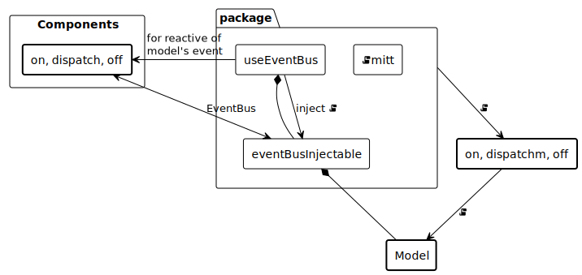

## React and EventBus Hook example

### 試したかったこと ( What I wanted to try )

React component では hooks を使い、普通の function call だけでできるだけ実現し、callback を避けるのが正義のように言われているような気がするが、結局 event driven プログラミングからは逃げられないのではないか？

In React components, it seems to be said that it is justified to use hooks, to achieve as much as possible using only normal function calls and to avoid callbacks, but in the end, we can't escape from event-driven programming ?

### やってみてどうだったか ( How did it feel to do it ? )

単純なメソッド呼び出しでは完了が訪れない（中断、再開もあり得る）タイマーを実装。このタイマーとコンポーネントの間に EventBus を用意し、タイマーの状態をイベントで伝えてもらうことでコンポーネントの表現や機能を切り替える処理を実装した。

そのままでもよかったのだが、思い立ってこの EventBus を利用するコードを custom hook にしてみた。すると「むしろ EventBus の初期化を hook にすると、他の hook を利用するコードと同じように扱え、かつ EventBus そのものを隠蔽できてよいのでは？」と思えた。

Implemented a timer that cannot be completed by a simple method call (it can be interrupted and restarted). An EventBus is provided between the timer and the component, and by having the timer's status communicated via events, I implemented a process for switching the component's expression and functions.

I could have left it as it was, but I decided to make a custom hook for the code that uses the EventBus. Then I thought, “Why not make the initialization of the EventBus into a hook so that it can be handled in the same way as code that uses other hooks, while hiding the EventBus itself ?" I started to think that it would be better to use hooks to initialize the EventBus.

### 概念図 ( Concept Diagram )

### 参考

 * [React / Remix への依存を最小にするフロントエンド設計 \- 一休\.com Developers Blog](https://user-first.ikyu.co.jp/entry/2024/08/05/142626)
 * [7GUIsで学ぶReact状態管理Jotai \| Timer 編 \(4/7\)](https://zenn.dev/jotaifriends/articles/644674c79fb431)
